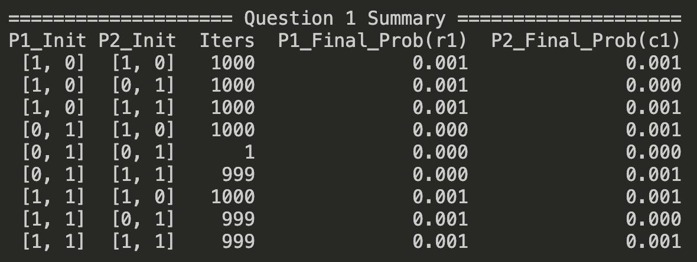
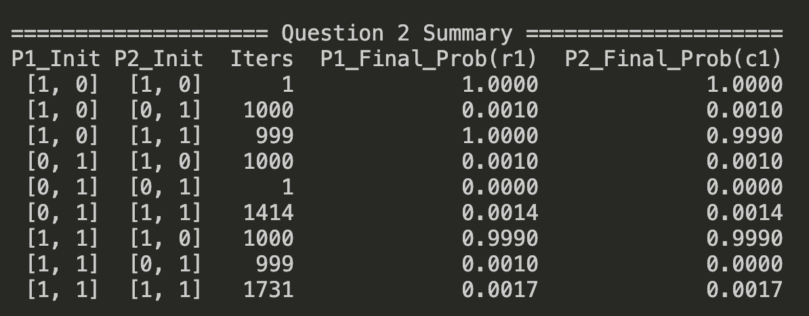
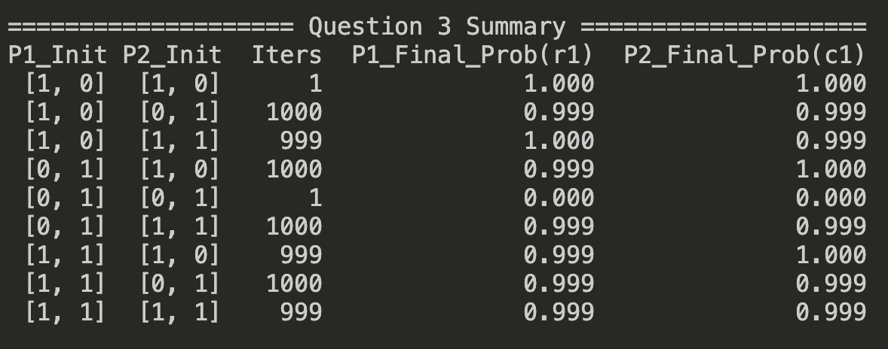
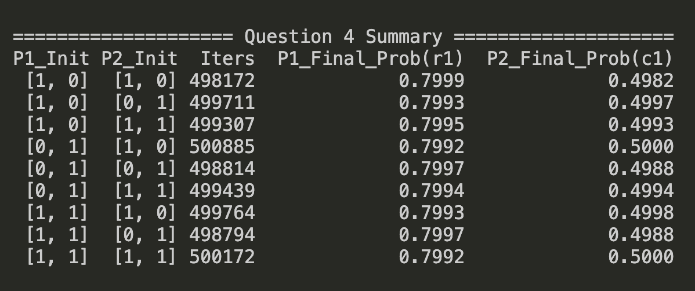
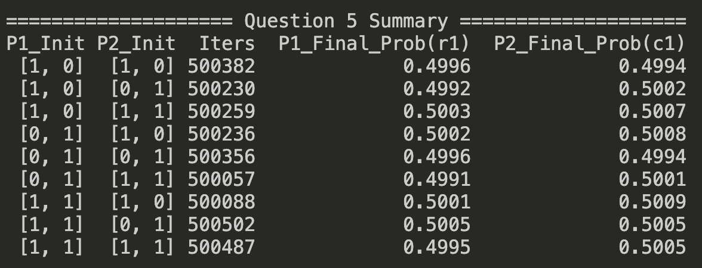
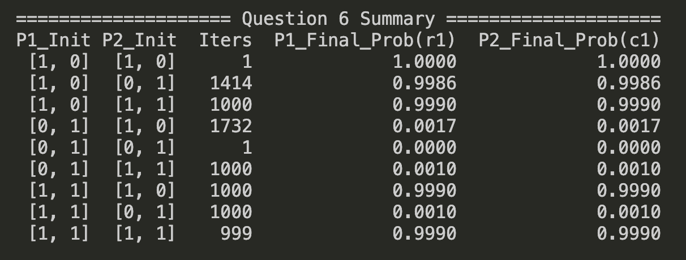
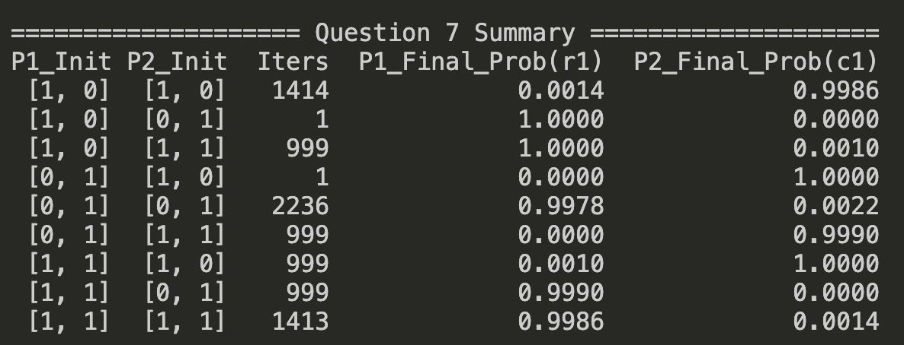
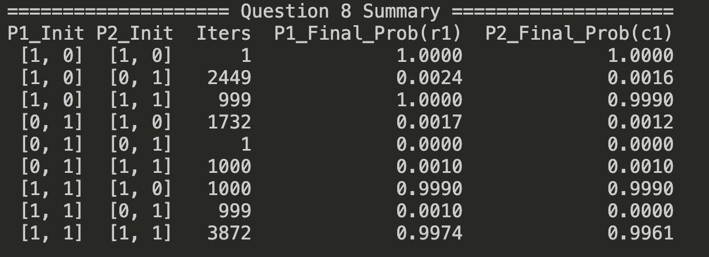
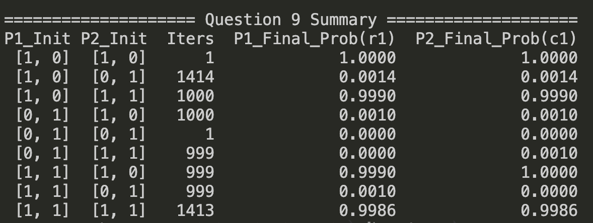

# 314581030 徐煜宸 HW2 report
## AI prompt
- 這個作業**我想要自己親自手刻為主**，所以基本上只有和AI討論架構跟偷懶叫他幫我直接把問題轉換成我註解寫的那種matrix格式（我不想一個一個手打）。
- 然後result輸出的部分包括畫matplot跟在終端機輸出表格這兩個function完全是他寫的，我叫他根據我自己手刻的experiment吐出來的解去轉換成好看的輸出。
- 但是主要的experiment是我自己一行一行手刻的，**所以沒有很明確的AI prompt**，但以下可以附上對話紀錄。
https://gemini.google.com/share/2f65b83413f0
## Code Explain
先定義epsilon跟MAX_ITER，等等experiment的結束條件就是依靠這兩個，參數具體怎麼調整其實還好，因爲最一開始我實驗設定1e-4+20000其實就差不多收斂到題目預期的解，這個設定很大只是會讓數字更精確而已。
```python
epsilon = 1e-6
MAX_ITER = 2000000
```
以inital_priors去設定三種情境，必出其中一個方法或者50% 50%，這邊之所以不是設定成機率等等可以在experiment裡面看到，我這邊其實隱含的意義是A選了一次？B選了一次？，或者A,B個選了一次？也就變相相當於下一次必出A或者必出B或者50/50。
```python
initial_priors = [
    [1, 0], # 必出 A
    [0, 1], # 必出 B
    [1, 1]  # 50% 50%
]
```
然後把所有問題都像這樣塞進一個3d array，將原題目轉換成matrix可以表達的狀態。
```python
# mat: 0:左上角, 1左下, 2右下, 3右上
# mat[x]: 0: Player1, 1: Player2
# mat: 0:左上角(r1,c1), 1:左下角(r2,c1), 2:右下角(r2,c2), 3:右上角(r1,c2)
# mat[x]: 0: Player1, 1: Player2
Q_all = [
    # Q1
    [
        [-1, -1],
        [0, 1],
        [3, 3],
        [1, 0]
    ],
    # Q2
    ...
]
```
這兩個function是處理輸出的，一個是畫出會收斂的圖（不過他會瞬間噴出81張圖，所以我先暫時註解掉了），等等在後面會找幾個有代表性的附上來解釋。
一個則是每個比賽在幾回合的時候會收斂。
```python
def plot_convergence(history, q_idx, p1_init, p2_init):
    # 提取歷史紀錄
    rounds = [h['round'] for h in history]
    p1_probs = [h['prev_p1_0'] for h in history]
    p2_probs = [h['prev_p2_0'] for h in history]
    
    plt.figure(figsize=(10, 5))
    plt.plot(rounds, p1_probs, label="Player 1 Prob (r1)", color='#1f77b4', linewidth=2)
    plt.plot(rounds, p2_probs, label="Player 2 Prob (c1)", color='#ff7f0e', linewidth=2)
    
    # 圖表美化
    title = f"Q{q_idx+1} Convergence (P1 Init:{p1_init}, P2 Init:{p2_init})"
    plt.title(title, fontsize=14, fontweight='bold')
    plt.xlabel("Iteration (Rounds)", fontsize=12)
    plt.ylabel("Probability of Action 1", fontsize=12)
    plt.ylim(-0.05, 1.05) # 機率範圍 0~1
    plt.legend(loc='best')
    plt.grid(True, linestyle='--', alpha=0.7)
    plt.tight_layout()
    
    # 存檔 (檔名會自動帶入題號與初始狀態)
    filename = f"Q{q_idx+1}_P1_{p1_init[0]}{p1_init[1]}_P2_{p2_init[0]}{p2_init[1]}.png"
    plt.savefig(filename, dpi=150)
    plt.close() # 關閉畫布避免記憶體爆掉

def generate_summary_table(q_idx, results_list):
    # results_list 是一個 list，裡面裝了這題 9 種組合的結果
    df = pd.DataFrame(results_list)
    
    print(f"\n{'='*20} Question {q_idx+1} Summary {'='*20}")
    # 在終端機印出精美表格
    print(df.to_string(index=False))
    
    # 如果你想把表格存成 csv 給報告用，可以取消下面這行的註解
    # df.to_csv(f"Q{q_idx+1}_summary.csv", index=False)
    
    # 甚至可以直接輸出 Markdown 格式
    # print("\nMarkdown 格式 (可直接貼上筆記軟體):")
    # print(df.to_markdown(index=False))
```
接下來是最關鍵的experiment的部分。
- 首先去check iteration的次數是否有超過MAX，然後我是取prev_p1_0（也就是前一個 step Player1 選 r1 的機率）跟prev_p2_0(也就是前一個 step Player2 選 c1 的機率)，去跟現在這個step比的結果，如果其中一方還大於epsilon，則代表還沒收斂。
- 接下來先更新prev們為當前的值（因為等等要覆蓋掉了），並且推入history list中，等等return出去畫表格用（其實可以畫逐step的解，但因為把epsilon設定的很小的話可能那個table就會變超大，所以我決定改以matplot+只存最後跑到第幾個it收斂去呈現）。
- 然後關鍵的算中間的ficious play的部分也就是E_P1[0]...那部分，我先以大小為二的list紀錄哪個動作的期望值大一些，然後下面再去作比較，如果兩個的期望值一樣就用random函數去隨便取一個+1，然後繼續剛剛的loop直到收斂。
```python
def experiment(prior1, prior2, Q):
    it_count = 0
    prev_p1_0 = -1
    prev_p2_0 =  -1
    history = []
    while it_count < MAX_ITER \
        and (abs(prev_p1_0-(prior1[0]/sum(prior1))) > epsilon \
            or abs(prev_p2_0-(prior2[0]/sum(prior2))) > epsilon):
        prev_p1_0 = prior1[0]/sum(prior1)
        prev_p2_0 = prior2[0]/sum(prior2)
        history.append({
            "round": it_count,
            "prev_p1_0": prev_p1_0,
            "prev_p2_0": prev_p2_0
        })
        # expect value of P1, P2
        E_P1, E_P2 = [0, 0], [0, 0]
        E_P1[0] = prior2[0]*Q[0][0]+prior2[1]*Q[3][0]
        E_P1[1] = prior2[0]*Q[1][0]+prior2[1]*Q[2][0]
        E_P2[0] = prior1[0]*Q[0][1]+prior1[1]*Q[1][1]
        E_P2[1] = prior1[0]*Q[3][1]+prior1[1]*Q[2][1]
        # 計算哪個好，好的那個動作就多做一次，如果一樣好就取隨機。
        if E_P1[0] > E_P1[1]:
            prior1[0] += 1
        elif E_P1[0] < E_P1[1]:
            prior1[1] += 1
        else:
            if (random.random() < 0.5):
                prior1[0] += 1
            else:
                prior1[1] += 1
        if E_P2[0] > E_P2[1]:
            prior2[0] += 1
        elif E_P2[0] < E_P2[1]:
            prior2[1] += 1
        else:
            if (random.random() < 0.5):
                prior2[0] += 1
            else:
                prior2[1] += 1
        it_count += 1 
    return prev_p1_0, prev_p2_0, history
```
最後把上面的東西都串起來就是類似main，總共跑9(9個遊戲)\*3(Player1有三種prior設定)\*3(Player2也有三種設定)，然後建成表格和圖。
```python
for it in range(9):
    # prior1, prior2個三種init
    q_results = []
    for i in range(3):
        for j in range(3):
            history = []
            final_p1_0, final_p2_0, history = experiment(list(initial_priors[i]), list(initial_priors[j]), Q_all[it])
            #plot_convergence(history, it, initial_priors[i], initial_priors[j])
            q_results.append({
                "P1_Init": str(initial_priors[i]),
                "P2_Init": str(initial_priors[j]),
                "Iters": len(history),
                "P1_Final_Prob(r1)": round(final_p1_0, 4),
                "P2_Final_Prob(c1)": round(final_p2_0, 4),
            })
    generate_summary_table(it, q_results)
```
## Question and Result
### Q1
- Answer to the Question:
    - 可以，他會收斂到{r2, c2}
- 我的理解：
    - 首先這個問題他的NE用IESDS可以人類直接算出他的答案是右下角有一個Pure Strategy NE，那從實驗結果也可以看出，[0, 1], [0, 1]（{r2, c2}）的解只會進去一次就會觸發他prev跟cur的答案小於epsilon，所以直接跳出來，然後回傳選r1, c1的機率是0，然後其他都跑大概1000次，哪怕是一開始設定[1, 0], [1, 0]的，也都會跑到選r1的機率是99.99（我在有取round 4，所以其實應該會更小）

### Q2
- Answer to the Question:
    - 可以收斂到兩個，只是起始點確實會造成影響。
- 我的理解：
    - 問題二變成NE會有兩個，而透過我們的設定確實也可以看出來他會有兩個NE，那只如果我們那個動作本身已經導致了NE，那他的iteration就會是1次就出來，跟上面那題一樣，例如[1, 0], [1, 0]（{r1, c1}）或[0, 1], [0, 1]（{r2, c2}），否則他就有可能亂跑到其中一邊，而即便理論上他們有mix-strategy NE，他們還是更會被pure strategy NE吸引過去。
- 然後我有個有趣的發現是，在9個解裡面，有只有3個會選{r1, c1}，另外6個則選{r2, c2}，這從解來看也合理，因為儘管兩的都是NE，但其實對於Player1, Player2來說，選r2, c2會有更大的reward(3, 3)。

### Q3
- Answer to the Question:
    - 算是可以，大部分都會跑去{r1, c1}，只有起始點就在{r2, c2}的會逃不走
- 我的理解：
    - 問題三則是因為有degenerate，所以理論上會有兩個NE，但他在慢慢窮舉的過程中會發現{r2, c2}這個NE根本得不到分，所以在這種weakly dominated的遊戲裡，反而就會乖乖慢慢地收斂到我們更喜歡的{r1, c1}去，但一開始就在{r2, c2}那個會因為怎麼走都沒有進步，所以跑一個iteration就跳出去了，以至於無法逃出分數為0的深淵。

### Q4
- Answer to the Question:
    - 可以。
- 我的理解：
    - 這個問題的點是因為小數計算要到無限大才會幾乎貼在P1:(0.8, 0.2), P2:(0.5, 0.5)上，所以如果我們不斷把epsilon拉大，那他就會需要更多的iteration才會收斂到理論上算出來的機率的小數，那可是儘管不是百分百精確，但完全可以看出不論我們怎麼調整設定，這題不會有任何pure strategy，並且每個起始點都會最後收斂到約等於mix-strategy NE的結果。

### Q5
- Answer to the Question:
    - 可以。
- 我的理解：
    - 這題跟前面那題有異曲同工之妙，一樣沒有pure strategy NE，而是只有mix-strategy的，那這個題目其實本質上很類似於剪刀石頭布，兩個策略算出來理論上都是50% 50%才是最佳解，所以我們的result也跟Q4一樣，儘管不是直接完全等於答案，但完全可以看得出趨勢是如此。

### Q6
- Answer to the Question:
    - 他會收斂到pure strategy的那兩個NE，而不會收斂到mix-strategy的。
- 這題其實跟前面有兩個pure NE的結果也是有點類似，不過這次因為兩個NE的數字一樣好，所以除了0.5, 0.5可能是因為機率性問題掉向其中一邊，不然他們的解幾乎是一半一半，都掉向了其中一邊的pure NE

### Q7
- Answer to the Question:
    - 他會收斂到pure strategy的那兩個NE，而不會收斂到mix-strategy的。
- 我的理解：
    - 這題跟前面那幾個理論上有mix-strategy NE但是所有解卻掉到pure NE的概念也一樣，只不過這次解答變成在{r2, c1}, {r1, c2}，

### Q8
- Answer to the Question:
    - 他會收斂到pure strategy的那兩個NE，而不會收斂到mix-strategy的。
- 我的理解：
    - 跟前面幾題還是一樣，{r1, c1}, {r2, c2}那兩個他因為直接對了所以不iteration，然後其他人經過loop一路往下跑還是會跑去這兩個其中一個，而沒有停在mix strategy。

### Q9
- Answer to the Quesiton:
    - 他會收斂到pure strategy的那兩個NE，而不會收斂到mix-strategy的。
- 我的理解：
    - 還是跟前面幾題差不多，他會收斂到那兩個NE，但我覺得這題有趣的是他拿{r1, c1}, {r2, c2}的兩個人裡的話，其實{r2, c2}的是5個，而{r1, c1}反而是4個，我認為這跟stag hunt game本質上是信任問題，導致於兩個玩家跑到哪個NE基本上是50% 50%可能有關。
